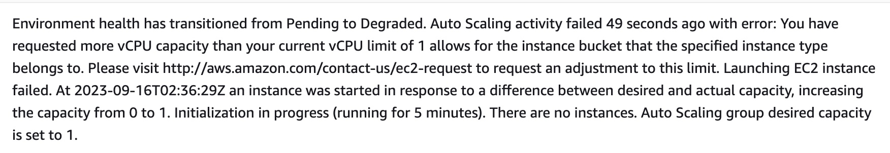
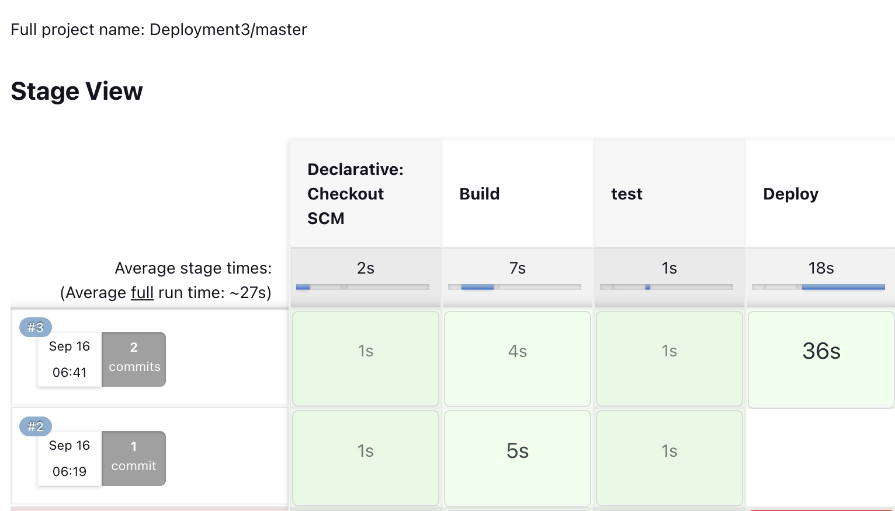
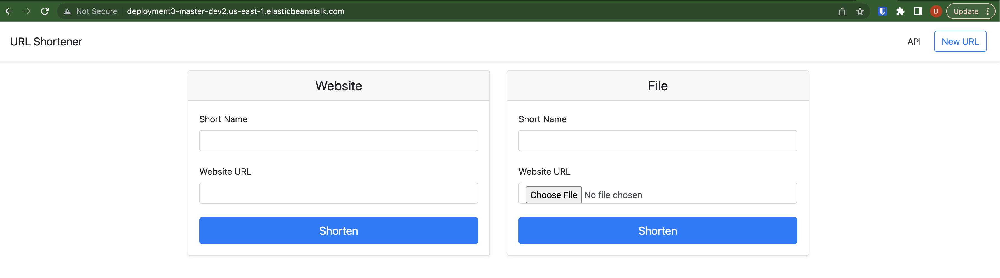
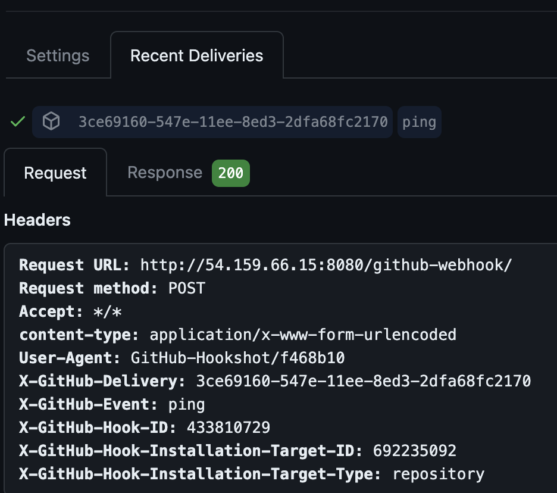
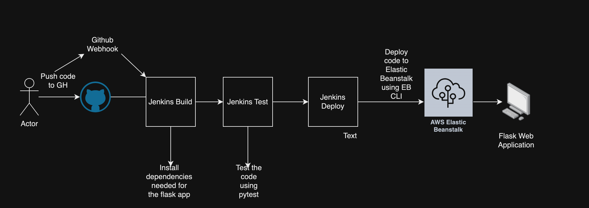
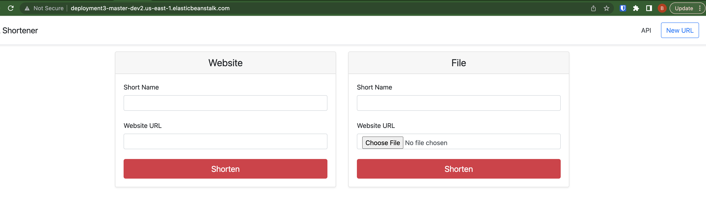

# Kura_C4_D3

## Purpose
- Deploy a web application in a fully automated Elastic Beanstalk Environment using Jenkins

## Issues
- When installing the aws eb cli as the jenkins user I was prompted that I needed to install python3-pip and I couldn't do it as the jenins user, I had to logout and install as the ubuntu user since it has sudoer rights and the jenkins user does not
- Ran into the issue in the screenshot below, not something I have the IAM permissions to fix. Realized that I had to switch AWS environments and not use the D3 one that was assigned

## Steps
1. Install Jenkins onto an EC2 Server
2. Configure Jenkins and run the Build and Test stages
3. Install AWS EB CLI to your EC2 Instance
4. Add the Deploy Stage to the Jenkins file that will deploy the application to Elastic Beanstalk automatically
    
    
5. Add a GitHub Webhook so any changes you make in the repository to the code will trigger the Jenkins pipeline and redeploy Elastic Beanstalk
    

## Systems Diagram

## Bonus

## Optimization
